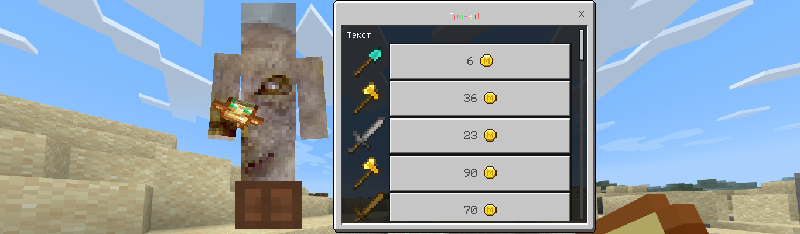
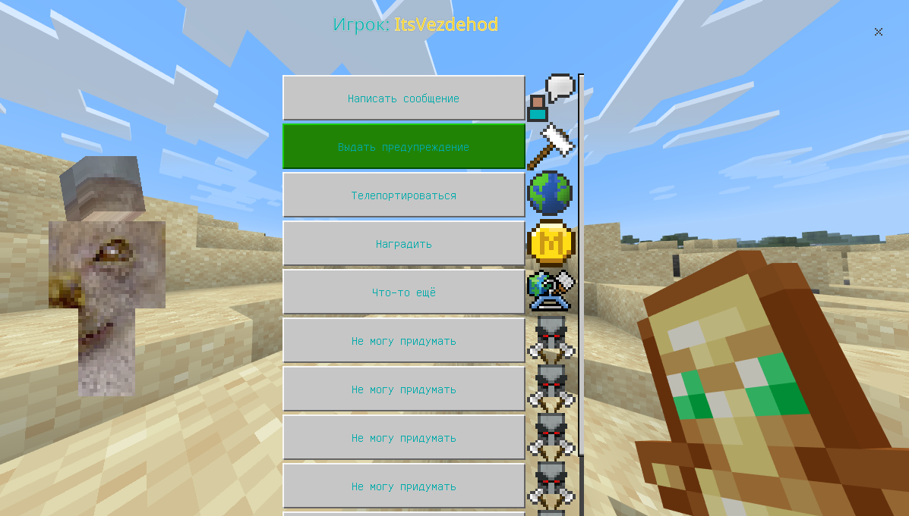
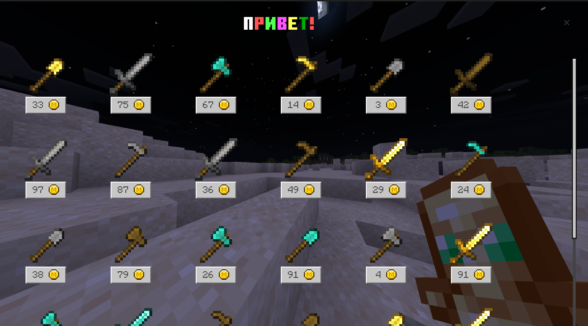

# Custom "Simple" Form Style


```php
$style = $content->getUI()->getJsonUIs()->createSimpleFromStyle();
$wrapper = $style->addStackPanel($style->getRootName(), Orientation::HORIZONTAL());
$wrapper->addCustom("skin_viewer")
    ->size(new Size("110px", "100px"))
    ->anchor(Anchor::LEFT_MIDDLE())
    ->renderer(CustomElement::LIVE_PLAYER_RENDERER);
$wrapper->addExtends("default", "server_form.long_form")
        ->anchor(Anchor::RIGHT_MIDDLE());
$style->setRootElement($wrapper);

$decorator =  $style->getDecorator();

// Later...
$player->sendForm($decorator->decorate($originalForm));
```


```php
$style = $content->getUI()->getJsonUIs()->createSimpleFromStyle();
$title = $style->addPanel("title")
    ->layer(5)
    ->size(new Size("100%", "10px"))
    ->anchor(Anchor::TOP_RIGHT())
    ->in(fn($elem) => $elem->addLabel("text")
        ->text(ScreenElement::getTitleBinding())
        ->fontType(FontType::SMOOTH())
        ->textAlignment(TextAlignment::CENTER())
        ->fontScaleFactor(1.5)
        ->anchor(Anchor::TOP_MIDDLE())
    )
    ->in(fn($elem) => $elem->addExtends("close_button", "common.close_button")
        ->anchor(Anchor::TOP_RIGHT())
    );

$contents = $style->addStackPanel("contents", Orientation::HORIZONTAL());

$uuidBinding = new Binding("player_uuid");
$contents->addCustom("skin_viewer")
    ->size(new Size("225px", "200px"))
    ->anchor(Anchor::LEFT_MIDDLE())
    ->renderer(CustomElement::PAPER_DOLL_RENDERER)
    ->useUuid(true)
    ->useSelectedSkin(true)
    ->rotation(Rotation::GESTURE_X())
    ->propertyInBag(PropertyBag::PLAYER_UUID, $uuidBinding)
    ->binding(DataBinding::viewRebind(SimpleFormStyle::getContentBinding(), $uuidBinding)); // Use form "content" field to uuid-storage

$btn = $style->addStackPanel("action_button", Orientation::HORIZONTAL())
    ->size(new Size("100%", "32px"));
$btn->addExtends("form_button", "common_buttons.light_text_button")
    ->anchor(Anchor::CENTER())
    ->size(new Size("100% - 32px", "32px"))
    ->setVar('pressed_button_name', 'button.form_button_click')
    ->setVar('border_visible', false)
    ->setVar('button_text', SimpleFormStyle::getButtonTextBinding())
    ->setVar('button_text_binding_type', BindingType::COLLECTION())
    ->setVar('button_text_grid_collection_name', SimpleFormStyle::getFormButtons())
    ->setVar('button_text_max_size', new Size("100%", "20px"))
    ->binding(DataBinding::collectionDetails(SimpleFormStyle::getFormButtons()));
$btn->addImage("image")
    ->size(new Size("32px", "32px"))
    ->anchor(Anchor::CENTER())
    ->layer(2)
    ->binding(DataBinding::overrideFromCollection(
        SimpleFormStyle::getFormButtons(),
        SimpleFormStyle::getButtonTextureBinding(),
        ImageElement::getTextureBinding())
    )
    ->binding(DataBinding::overrideFromCollection(
        SimpleFormStyle::getFormButtons(),
        SimpleFormStyle::getButtonTextureFSBinding(),
        ImageElement::getTextureFSBinding()
    ));

$actions = $style->addStackPanel("scrolling_view", Orientation::VERTICAL())
    ->anchor(Anchor::CENTER())
    ->size(new Size("100%", "100%c"))
    ->factory("buttons", $btn->getId())
    ->collectionName(SimpleFormStyle::getFormButtons())
    ->binding(DataBinding::override(SimpleFormStyle::getButtonsLengthBinding(), StackPanelElement::getCollectionLengthBinding()));


$contents->addExtends("contents", "common.scrolling_panel")
    ->layer(1)
    ->anchor(Anchor::TOP_RIGHT())
    ->size(new Size("100%", "100%"))
    ->setVar("show_background", false)
    ->setVar("scrolling_content", $actions->getId())
    ->setVar("scrolling_pane_size", new Size("200px", "100%"))
    ->setVar("scrolling_pane_offset", new Offset("2px", "0px"))
    ->setVar("scroll_bar_right_padding_size", new Size("0px", "0px"));

$root = $style->addStackPanel($style->getRootName(), Orientation::VERTICAL())
    ->size(new Size("100% - 50px", "100% - 20px"));
$root->addExtends("title", $title->getId());
$root->addPanel("padding")->size(new Size("100%", "30px"));
$root->addExtends("contents", $contents->getId());

$style->setRootElement($root);

$decorator = $style->getDecorator();

//Later
$player->sendForm(
    FormBuilder::newSimple("Player: {$target->getName()}", $target->getUniqueId()->toString())
    ->withButton("Send message", fn() => ...)
    ...
    ->build()
);
```

```php
$style = $content->getUI()->getJsonUIs()->createSimpleFromStyle();
$title = $style->addPanel("title")
    ->layer(5)
    ->size(new Size("100%", "10px"))
    ->anchor(Anchor::TOP_RIGHT())
    ->in(fn($elem) => $elem->addLabel("text")
        ->text(ScreenElement::getTitleBinding())
        ->fontType(FontType::MINECRAFTTEN())
        ->textAlignment(TextAlignment::CENTER())
        ->fontScaleFactor(2)
        ->anchor(Anchor::TOP_MIDDLE())
    )
    ->in(fn($elem) => $elem->addExtends("close_button", "common.close_button")->anchor(Anchor::TOP_RIGHT()));

$buttonTemplate = $style->addStackPanel("gridded_button", Orientation::VERTICAL())
    ->anchor(Anchor::TOP_RIGHT())
    ->size(new Size("90px", "90px"))
    ->in(fn($elem) => $elem->addImage("image")
        ->size(new Size("45px", "45px"))
        ->layer(2)
        ->binding(DataBinding::overrideFromCollection(
            SimpleFormStyle::getFormButtons(),
            SimpleFormStyle::getButtonTextureBinding(),
            ImageElement::getTextureBinding())
        )
        ->binding(DataBinding::overrideFromCollection(
            SimpleFormStyle::getFormButtons(),
            SimpleFormStyle::getButtonTextureFSBinding(),
            ImageElement::getTextureFSBinding()
        ))
    )
    ->in(fn($elem) => $elem->addExtends("real_button", "common_buttons.light_text_button")
        ->anchor(Anchor::TOP_LEFT())
        ->size(new Size("45px", "20px"))
        ->setVar('pressed_button_name', 'button.form_button_click')
        ->setVar('border_visible', false)
        ->setVar('button_text', SimpleFormStyle::getButtonTextBinding())
        ->setVar('button_text_binding_type', BindingType::COLLECTION())
        ->setVar('button_text_grid_collection_name', SimpleFormStyle::getFormButtons())
        ->setVar('button_text_max_size', new Size("100%", "20px"))
        ->binding(DataBinding::collectionDetails(SimpleFormStyle::getFormButtons()))
    );

$viewport = $style->addGrid("scrolling_view")
    ->anchor(Anchor::TOP_RIGHT())
    ->size(new Size("100%", "100%c"))
    ->offset(new Offset("5px", "5px"))
    ->gridItemTemplate($buttonTemplate->getId())
    ->gridRescalingType(Orientation::HORIZONTAL())
    ->collectionName(SimpleFormStyle::getFormButtons())
    ->binding(DataBinding::override(SimpleFormStyle::getButtonsLengthBinding(), GridElement::getMaximumGridItemsBinding()));

$contents = $style->addExtends("contents", "common.scrolling_panel")
    ->anchor(Anchor::CENTER())
    ->size(new Size("100%", "100%"))
    ->offset(new Offset("0", "-8"))
    ->setVar("show_background", false)
    ->setVar("scrolling_content", $viewport->getId())
    ->setVar("scroll_size", new Size("5px", "100% - 20px"))
    ->setVar("scrolling_pane_size", new Size("100%", "100% - 20px"));

$root = $style->addStackPanel($style->getRootName(), Orientation::VERTICAL())
    ->size(new Size("100% - 50px", "100% - 20px"));
$root->addExtends("title", $title->getId());
$root->addPanel("padding")->size(new Size("100%", "30px"));
$root->addExtends("contents", $contents->getId());

$style->setRootElement($root);
```
